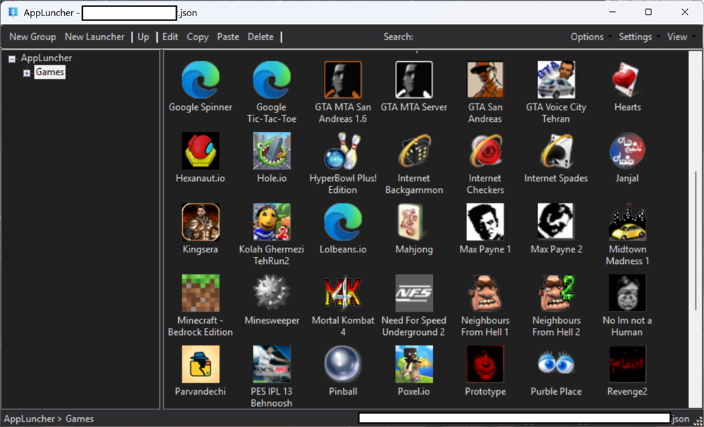
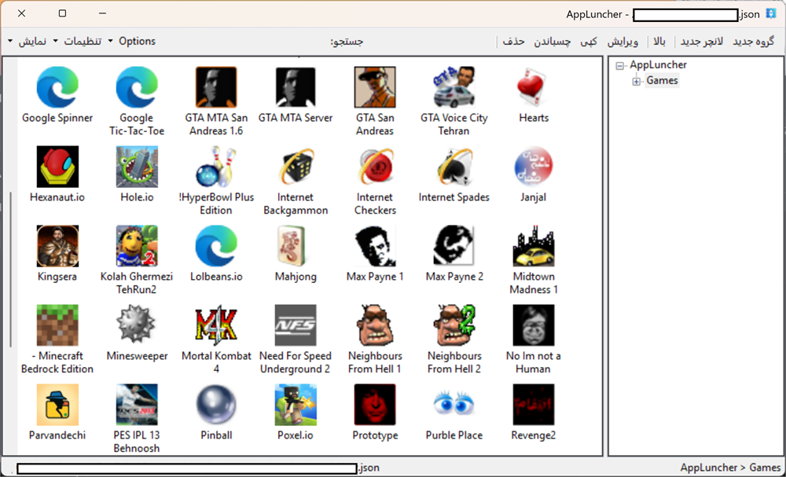

<div align="center">

# 🚀 AppLuncher

**A lightweight, blazing-fast, and customizable application launcher for Windows.**
**یک راه‌انداز برنامهٔ سبک، بسیار سریع و قابل شخصی‌سازی برای ویندوز.**


[Key Features](#-features) • [Installation](#-getting-started) • [How to Use](#-how-to-use) • [Roadmap](#-roadmap) • [Contributing](#-contributing)

</div>

---

## 📥 Downloads (v1.5 - Stable) / دانلودها (نسخه پایدار ۱.۵)

Get the latest stable version of **AppLuncher** below:
آخرین نسخهٔ پایدار اپ‌لانچر را از پیوندهای زیر دریافت کنید:

| Version / نسخه | Type / نوع | Download Link / لینک دانلود |
| :--- | :--- | :--- |
| **v1.5** | 🛠️ **Installer (Setup)** / نصب‌کننده | [Download `.exe` Setup](https://github.com/hmovaghari/AppLuncher/releases/download/w.1.5/AppLuncher.1.5.Setup.exe) |
| **v1.5** | 🚀 **Portable (ZIP)** / نسخه پرتابل | [Download `.zip` Portable](https://github.com/hmovaghari/AppLuncher/releases/download/w.1.5/AppLuncher.1.5.zip) |

> [!TIP]
> Use the **Installer** for a permanent installation on your system, or the **Portable** version if you want to run it directly from a USB drive without installation.
> 
> > [!TIP]
> > برای نصب دائمی روی سیستم خود از نسخهٔ نصب‌کننده استفاده کنید. اگر می‌خواهید برنامه را مستقیماً از روی حافظهٔ همراه و بدون نصب اجرا کنید، نسخهٔ قابل‌حمل مناسب است.

---

## 💡 What is AppLuncher? / AppLuncher چیست؟

**AppLuncher** is a Windows Forms application built with **C# and .NET Framework 4.8**. It is designed to replace messy desktop shortcuts with a clean, organized, and lightning-fast command hub. Whether you are a power user, developer, or gamer, AppLuncher lets you access your favorite programs, tools, and scripts in milliseconds.

اپ‌لانچر یک برنامهٔ ویندوزی است که با زبان سی‌شارپ و چارچوب دات‌نت نسخهٔ ۴٫۸ ساخته شده است. این برنامه طراحی شده تا میانبرهای شلوغ دسکتاپ را با یک مرکز فرماندهی تمیز، منظم و فوق‌سریع جایگزین کند. چه یک کاربر حرفه‌ای باشید، چه توسعه‌دهنده یا علاقه‌مند به بازی، اپ‌لانچر به شما اجازه می‌دهد در کسری از ثانیه به برنامه‌ها، ابزارها و دست‌نوشته‌های مورد علاقهٔ خود دسترسی داشته باشید.

---

## ✨ Features / ویژگی‌ها

- ⚡ **Lightweight & Fast:** Designed specifically for Windows using .NET Framework 4.8 for maximum compatibility.
- ⚡ **سبک و سریع:** مخصوص ویندوز طراحی شده است تا با بیشترین سازگاری اجرا شود.

- 🎯 **Quick Launch:** Organize software into clean categories and launch them with a single click or keypress.
- 🎯 **اجرای سریع:** سازماندهی نرم‌افزارها در دسته‌بندی‌های منظم و اجرای آن‌ها تنها با یک کلیک یا فشردن کلید.

- 📌 **System Tray Integration:** Minimize to the system tray and keep your desktop clean.
- 📌 **یکپارچگی با ناحیهٔ اعلان:** قابلیت کوچک‌شدن در کنار ساعت ویندوز برای حفظ نظم دسکتاپ.

- 🔍 **Search & Filter:** Instant search capability to find your apps without browsing menus.
- 🔍 **جستجو و فیلتر:** قابلیت جستجوی آنی برای یافتن برنامه‌ها بدون نیاز به گشتن در منوها.

- 🎨 **Clean & Intuitive UI:** Modern Windows interface tailored for speed and efficiency.
- 🎨 **رابط کاربری تمیز و بصری:** رابط کاربری مدرن ویندوزی که برای سرعت و کارایی بالا بهینه‌سازی شده است.

- ⚙️ **Custom Shortcuts:** Easily add, edit, or remove program paths and parameters.
- ⚙️ **میانبرهای دلخواه:** امکان افزودن، ویرایش یا حذف آسان مسیر برنامه‌ها و پارامترهای آن‌ها.

---

## 📸 Screenshots / اسکرین‌شات‌ها

| English dark theme / نمای تیرهٔ انگلیسی | Persian light theme / نمای روشنٔ فارسی |
| :---: | :---: |
|  |  |

---

## 🚀 Getting Started (For Developers) / شروع کار (برای توسعه‌دهندگان)

### Prerequisites

- **Operating system:** Windows 7 SP1, Windows 8.1, Windows 10, or Windows 11
- **Runtime:** .NET Framework 4.8

### پیش‌نیازها

- **سیستم‌عامل:** ویندوز ۷ با بستهٔ خدماتی ۱، ویندوز ۸٫۱، ویندوز ۱۰ یا ویندوز ۱۱
- **محیط اجرا:** چارچوب دات‌نت نسخهٔ ۴٫۸

### Installation & Run / نصب و اجرا

1. **Clone the Repository / کلون کردن مخزن:**
```bash
   git clone https://github.com/hmovaghari/AppLuncher.git
   cd AppLuncher
```

---

## 🔐 Code Signing Policy / سیاست امضای کد

Free code signing provided by SignPath.io, certificate by SignPath Foundation.

امضای رایگان کد توسط بنیاد ساین‌پث ارائه می‌شود و گواهی امضا به نام این بنیاد صادر شده است.

### Privacy Policy / سیاست حریم خصوصی

AppLuncher does not transfer any information to other networked systems unless specifically requested by the user or the person installing or operating it.

اپ‌لانچر هیچ اطلاعاتی را به سیستم‌های دیگر در شبکه ارسال نمی‌کند، مگر اینکه این کار به‌طور مشخص توسط کاربر یا شخصی که برنامه را نصب یا اجرا می‌کند درخواست شده باشد.
